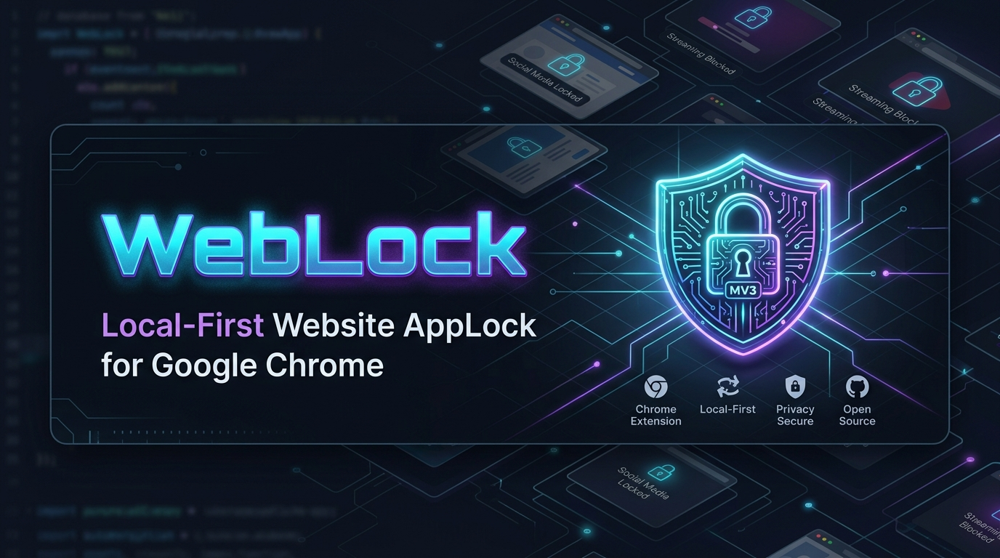

<div align="center">



# 🔐 WebLock — Website AppLock for Google Chrome

[](LICENSE)
[](manifest.json)
[](tests/)
[](#-privacy--local-first-architecture)
[](#-quick-start--installation)

<p align="center">
  <strong>Smartphone-style AppLock protection for desktop web browsing.</strong><br>
  Lock distracting or private websites behind a master password with per-tab isolation.
</p>

</div>

---

## 🌟 Overview

**WebLock** brings mobile AppLock security directly to Google Chrome. When you navigate to a locked website (such as YouTube, Instagram, Reddit, or any custom domain), WebLock instantly intercepts the navigation using native **DeclarativeNetRequest (DNR)** rules before page scripts or tracking pixels can load, presenting a sleek, dark-mode lock screen.

Once authenticated, **only that specific tab is unlocked**. Other tabs, newly opened windows, and background sessions remain completely locked.

---

## ✨ Key Features

### 🔐 Dual-Engine Password Architecture
Choose how each website is protected:
- **🔐 WebLock Password**: Protected by your master password. Unlock any universal-mode website with your primary credential.
- **🔑 Separate Password**: Give individual sites their own unique password. Even if someone knows your master password, they cannot access separate-password sites without your explicit authorization.

### 🛡️ 1-of-3 Security Recovery Flow
Never lose access to your locked websites:
- Configure **3 security questions** during setup or in Settings.
- If you forget your master password, correctly answering **ANY ONE** of your 3 questions authorizes an immediate password reset.
- Recovery questions and answers are normalized (case-insensitive, whitespace-tolerant) and hashed with independent random salts using PBKDF2.

### ⚡ True Per-Tab Isolation (No Global Leaks)
- Unlocking a site creates a tab-scoped DNR session rule (`priority: 2, action: { type: "allow" }`).
- Browsing, page refreshes, and internal links within that tab stay unlocked.
- Opening the same domain in another tab or window immediately triggers the lock screen again.
- Closing the tab automatically revokes the session rule via `chrome.tabs.onRemoved`.

### 🌐 Smart Dynamic Favicons & Deterministic Fallbacks
- Resolves website favicons dynamically using non-blocking multi-source resolution (cache, open tabs, Google S2, DuckDuckGo, direct origin).
- Offline or unresolvable icons automatically generate a crisp, deterministic SVG monogram badge styled with a unique color derived from the domain name.

### 👁️ "Reveal Mode Only" Privacy
- WebLock **never displays or stores plaintext password values**.
- The Dashboard, Popup, and Lock Screen show visual **password mode badges only**:
  - `🔐 WebLock password` (*Same password used for other protected sites*)
  - `🔑 Separate password` (*Only this website uses this password*)
- Forgotten site-specific passwords can be safely reset on the lock screen or dashboard through master password authorization.

### 🕶️ Incognito Mode Protection
- Full parity between normal windows and Incognito mode.
- Locked websites are intercepted in private windows just like normal tabs when "Allow in Incognito" is enabled in Chrome.

---

## 🔒 Privacy & Local-First Architecture

WebLock is **100% Local-First**:
- **Zero Backend**: No remote servers, no cloud storage, no account registration.
- **Zero Credential Transmission**: Passwords and recovery answers are **never** transmitted over the network.
- **Zero Telemetry**: No analytics, tracking pixels, or third-party monitoring scripts.
- **Client-Side Cryptography**: Password hashes are salted using cryptographic 16-byte random salts and derived with PBKDF2-HMAC-SHA256 across **310,000 iterations**. Timing attacks are mitigated using constant-time comparison.

---

## 🚀 Quick Start & Installation

### 1. Load Unpacked in Google Chrome
1. Clone or download this repository:
   ```bash
   git clone https://github.com/yushy07/weblock.git
   ```
2. Open Google Chrome and navigate to `chrome://extensions/`.
3. Enable **Developer mode** using the toggle in the top-right corner.
4. Click **Load unpacked** in the top-left corner.
5. Select the repository folder.
6. WebLock will install instantly!

### 2. Initial Setup
On first install, the **WebLock Dashboard** opens automatically:
1. Set your **Master Password** (min. 4 characters).
2. Configure your **3 Recovery Questions**.
3. Choose starter distraction websites (YouTube, Instagram, Reddit, etc.) or add your own custom domains.

### 3. Enable Incognito Protection (Recommended)
1. In `chrome://extensions/`, find **WebLock**.
2. Click **Details**.
3. Toggle on **Allow in Incognito**.
4. Private browsing tabs are now protected with the same per-tab lock screen!

---

## 🧪 Automated Testing

WebLock includes a Vitest test suite covering crypto, domain normalization, recovery mechanics, password modes, and storage migrations:

```bash
npm test
```

```text
 ✓ tests/favicons.test.js (3 tests)
 ✓ tests/crypto.test.js (4 tests)
 ✓ tests/recovery.test.js (4 tests)
 ✓ tests/password-modes.test.js (3 tests)
 ✓ tests/domains.test.js (9 tests)
 ✓ tests/migration.test.js (3 tests)

 Test Files  6 passed (6)
      Tests  26 passed (26)
   Duration  993ms
```

---

## 📂 Project Architecture

```text
weblock/
├── assets/
│   ├── banner.png             # GitHub repository banner
│   └── logo.png               # WebLock cyber shield app logo
├── manifest.json              # Chrome Manifest V3 declaration
├── package.json               # Scripts, vitest dependency, metadata
├── LICENSE                    # Apache License 2.0
├── README.md                  # Project documentation
├── public/
│   └── icons/                 # 16x16, 32x32, 48x48, 128x128 extension icons
├── scripts/
│   ├── resize-icons.ps1       # Generates crisp PNG extension icons from logo
│   └── generate-icons.js      # Pure Node PNG buffer fallback generator
├── src/
│   ├── background/
│   │   ├── rules.js           # DeclarativeNetRequest dynamic & session rules
│   │   └── service-worker.js  # Main SW lifecycle, auth & message dispatcher
│   ├── dashboard/
│   │   ├── dashboard.html     # Management dashboard & 4-step onboarding wizard
│   │   ├── dashboard.css      # Dark-mode dashboard styling
│   │   └── dashboard.js       # Site management, search, presets & mode switching
│   ├── lock/
│   │   ├── lock.html          # Lock screen UI with subtle recovery flow
│   │   ├── lock.css           # Specular dark glass styling
│   │   └── lock.js            # Authentication, rate limit cooldowns & recovery
│   ├── options/
│   │   ├── options.html       # Extension options & recovery question manager
│   │   ├── options.css        # Options styling
│   │   └── options.js         # Master password changes, export/import & sessions
│   ├── popup/
│   │   ├── popup.html         # Quick-access extension popup
│   │   ├── popup.css          # Compact popup styling
│   │   └── popup.js           # Current tab lock toggle & mode indicators
│   ├── security/
│   │   └── crypto.js          # Web Crypto PBKDF2, salt generation & normalization
│   ├── storage/
│   │   └── storage.js         # Idempotent storage migration & local state wrapper
│   └── utils/
│       ├── constants.js       # Message types, password modes & question bank
│       ├── domains.js         # Domain normalization & DNR regex pattern generator
│       ├── favicons.js        # Dynamic favicon resolver & SVG monogram generator
│       └── icons.js           # Inlined SVG icon library
└── tests/
    ├── crypto.test.js         # PBKDF2 hashing & constant-time compare tests
    ├── domains.test.js        # Domain normalization & DNR rule tests
    ├── favicons.test.js       # Favicon resolver & fallback SVG tests
    ├── migration.test.js      # Idempotent storage migration tests
    ├── password-modes.test.js # Universal vs. separate password tests
    └── recovery.test.js       # 1-of-3 recovery & answer normalization tests
```

---

## 📄 License & Copyright

Licensed under the **Apache License, Version 2.0**.

Copyright © 2026 **Ayush Kant**. All rights reserved.

See the [LICENSE](LICENSE) file for details.
